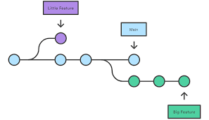

## Git Bash — это командная строка в Windows, которая позволяет выполнять команды Git. Помимо них, она содержит все стандартные команды Bash. Git GUI — это графический интерфейс для Git, который позволяет выполнять все основные операции с Git без использования командной строки.

>                       git_bash
>  git branch "impl-branch-name"
>  git checkout -b "impl-branch-name"

>                       git_bash
>  git push -u origin impl-branch-name

>                       git_bash
>  git add .

>                       git_bash
>   git commit -m "any"
  
>                       git_bash
>  git push

## Команда git branch позволяет создавать, просматривать, переименовывать и удалять ветки.
